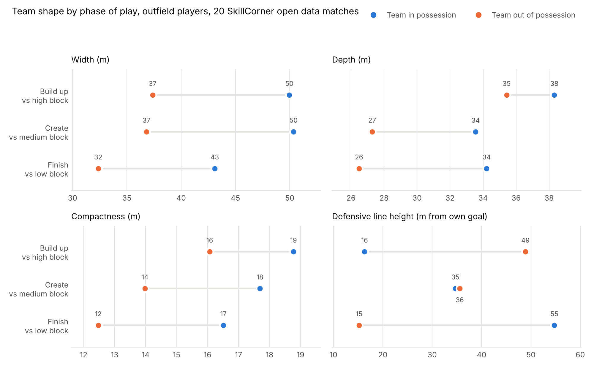
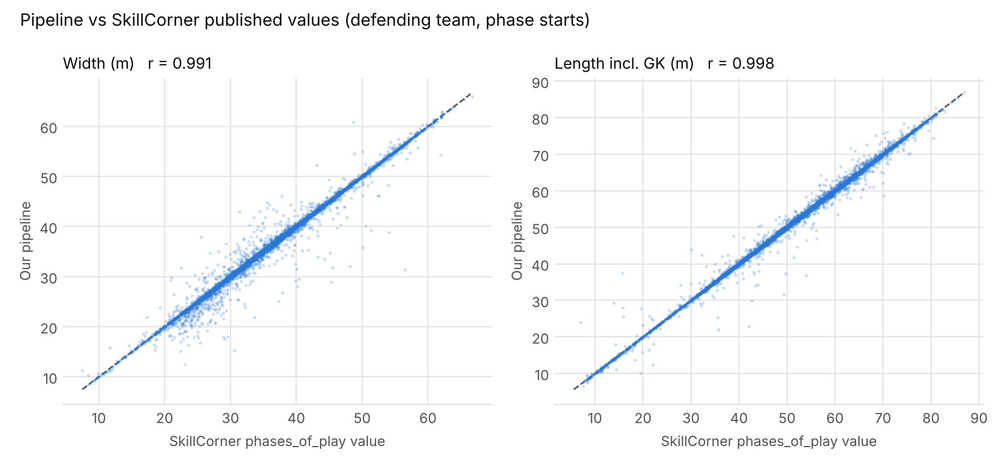

# Team Shape from SkillCorner Tracking Data

A pipeline that turns SkillCorner broadcast tracking data into team shape features at 10 Hz, labels every frame with possession and phase of play, and validates the output against the metrics SkillCorner publishes itself.

Built on the [SkillCorner open data](https://github.com/SkillCorner/opendata): 20 A-League matches from the 2024/25 season, 1.76 million team-frames.



## Features

Computed for outfield players only, per team, per frame (10 frames per second).

| Feature | Definition |
|---|---|
| Width | max y minus min y (m) |
| Depth | max x minus min x (m) |
| Compactness | mean distance from each player to the team centroid (m) |
| Defensive line height | distance of the deepest outfield player from the team's own goal line (m) |

## Results

**The shapes move the way football says they should.** In build up and create, the team in possession is about 13 m wider than its opponent. A defending team's back line sits 49 m from its own goal in a high block and 15 m in a low block. Of the three defensive blocks, the low block is the most compact (12 m average distance to centroid, against 16 m in a high block).

**The pipeline is validated against SkillCorner's own numbers.** SkillCorner's `phases_of_play` files report each team's width and length at the start and end of every phase. At phase starts, this pipeline matches them with r = 0.99 and a median absolute error of 0.01 m.



| Team | Feature | Pearson r | Median abs. error |
|---|---|---|---|
| In possession | Width | 0.994 | 0.01 m |
| In possession | Length incl. GK | 0.994 | 0.01 m |
| Out of possession | Width | 0.991 | 0.01 m |
| Out of possession | Length incl. GK | 0.998 | 0.01 m |

About 15% of phases differ by more than 0.5 m. These cluster in frames where fewer players are visible on camera, and the errors are symmetric around zero. This is consistent with SkillCorner computing phase metrics on a slightly different version of the extrapolated (off camera) positions for some matches, not a systematic error in the pipeline. Full table: [`data/processed/validation_vs_skillcorner.csv`](data/processed/validation_vs_skillcorner.csv).

Note that SkillCorner's team length includes the goalkeeper. The main `depth` feature here excludes the goalkeeper, since the goalkeeper's position mostly measures distance to the back line rather than team shape. The column `depth_incl_gk` exists only for this validation.

## Method

1. **Load** each match's tracking (`tracking_extrapolated.jsonl`), metadata (`match.json`) and phases (`phases_of_play.csv`).
2. **Drop goalkeepers** using the `GK` role in `match.json`. Every team-frame then has exactly 10 players.
3. **Normalize direction.** `home_team_side` gives each team's attacking direction per period. Coordinates are rotated 180 degrees where needed so every team always attacks toward +x and its flanks stay on the same side.
4. **Tag possession** from the tracking `possession.group` field.
5. **Attach phase of play.** The team in possession gets the in possession phase (build_up, create, finish, direct, quick_break, transition, set_play, chaotic). The other team gets the paired out of possession phase (high_block, medium_block, low_block, ...).
6. **Compute features** per team per frame.

## Repository layout

```
├── src/
│   ├── download_data.py        fetch raw tracking files (1.8 GB, not stored in repo)
│   ├── shape_pipeline.py       steps 1 to 6 above
│   └── validate_and_plot.py    validation stats, summaries, figures
├── data/
│   ├── raw/<match_id>/         match.json and phases_of_play.csv for all 20 matches
│   └── processed/
│       ├── shape_features/<match_id>.parquet   one row per team per frame
│       ├── shape_by_team_and_phase.csv         mean features per team per phase
│       └── validation_vs_skillcorner.csv
└── figures/
```

### `shape_features` columns

`match_id`, `frame`, `period`, `team_name`, `team_id`, `is_home`, `in_possession` (from tracking), `n_players`, `width`, `depth`, `compactness`, `line_height`, `centroid_x`, `depth_incl_gk`, `phase`, `phase_index`, `phase_team_in_possession` (from phases file). Distances in meters, rounded to 1 cm. About 30% of frames fall outside any labeled phase (dead ball and stoppages), so `phase` is empty there.

Load everything in one line:

```python
import pandas as pd
df = pd.read_parquet("data/processed/shape_features")
```

## Reproduce

```bash
pip install -r requirements.txt
python src/download_data.py       # about 1.8 GB
python src/shape_pipeline.py      # about 2 minutes
python src/validate_and_plot.py
```

The tracking files are stored with Git LFS in SkillCorner's repo. `download_data.py` uses GitHub's media URL, which serves the real file, so you don't need Git LFS installed.

## Data and license

Code in this repository is MIT licensed. Raw data is from [SkillCorner open data](https://github.com/SkillCorner/opendata), also MIT licensed; see [`data/raw/LICENSE_SKILLCORNER`](data/raw/LICENSE_SKILLCORNER).
